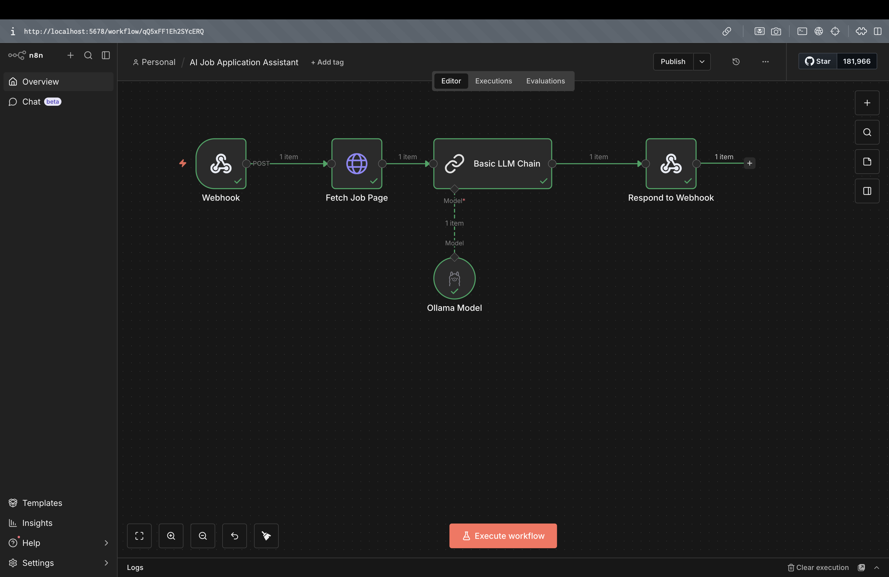
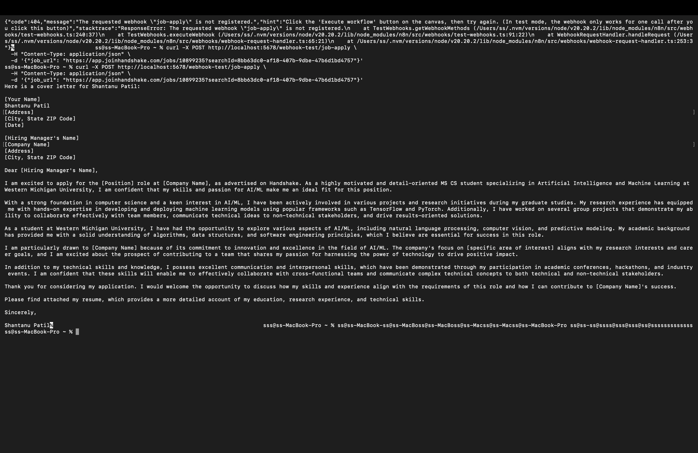

# 🤖 AI Job Application Assistant

An end-to-end AI automation pipeline built with **n8n** and a **local LLM (Llama 3.2 via Ollama)** that generates personalized cover letters from job postings — no paid API required.

## 🎯 What It Does

Send a job description to a webhook → the pipeline processes it through a local LLM → returns a fully written, personalized cover letter in seconds.

```
POST /webhook/job-apply
      ↓
Fetch Job Page (HTTP Request)
      ↓
Basic LLM Chain (Llama 3.2 via Ollama)
      ↓
Respond to Webhook (Cover Letter)
```

## 🛠 Tech Stack

| Tool | Role |
|------|------|
| [n8n](https://n8n.io) | Workflow automation platform |
| [Ollama](https://ollama.com) | Local LLM runtime |
| [Llama 3.2](https://ollama.com/library/llama3.2) | Language model (runs on-device) |
| Webhook | HTTP trigger for the pipeline |

## 🚀 Setup & Run

### Prerequisites
- Node.js v20+
- [Ollama](https://ollama.com) installed

### 1. Pull the model
```bash
ollama pull llama3.2
```

### 2. Start Ollama
```bash
ollama serve
```

### 3. Start n8n
```bash
npm install -g n8n
n8n start
```

### 4. Import the workflow
- Open `http://localhost:5678`
- Go to **⋯ → Import from file**
- Import `workflow.json` from this repo
- Set Ollama credential URL to `http://127.0.0.1:11434`

### 5. Test it
```bash
curl -X POST http://localhost:5678/webhook-test/job-apply \
  -H "Content-Type: application/json" \
  -d '{"job_url": "We are hiring a Python AI Engineer with experience in LangChain, RAG systems, and automation pipelines."}'
```

## 📸 Demo

**Workflow Canvas:**



**Generated Cover Letter Output:**



## 💡 Key Concepts Demonstrated

- **Webhook trigger** — HTTP POST endpoint that starts the pipeline
- **LLM orchestration** — Prompt engineering with dynamic input via `{{ $json.body.job_url }}`
- **Local AI** — Fully offline inference using Ollama, no API costs
- **n8n automation** — Visual pipeline with nodes connected via data flow
- **Respond to Webhook** — Controlled response back to the caller after LLM processing

## 🔧 Customization

To personalize the cover letter for yourself, open the **Basic LLM Chain** node and edit the prompt:

```
You are a career coach. Read this job posting and write a cover letter 
for [YOUR NAME], a [YOUR ROLE] with experience in [YOUR SKILLS].

Job posting:
{{ $json.body.job_url }}

Write a professional cover letter.
```

## 📁 Files

```
├── README.md
├── workflow.json       # n8n workflow export
├── workflow.png        # Canvas screenshot
└── output.png          # Sample output screenshot
```

## 👤 Author

**Shantanu Patil**  
MS Computer Science (AI/ML) — Western Michigan University  
[GitHub](https://github.com/shantanupatil003)
